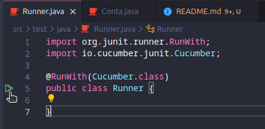
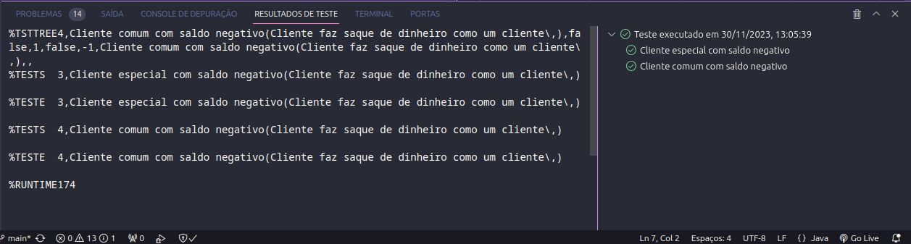

# Cucumber Conta Bancária

## Versão: 0.1

## Status do Projeto: 🚧 Em Andamento

## Tópicos

- [Descrição do projeto](#descrição-do-projeto)

- [Funcionalidades](#funcionalidades)

- [Distribuição](#distribuição)

- [Pré-requisitos](#pré-requisitos)

- [Como rodar a aplicação](#como-rodar-a-aplicação)

- [Testes realizados](#testes-realizados)
  - [Informativo](#informativo)
  - [Testes de Sistema](#testes-de-sistema)

- [Linguagens, dependências e libs utilizadas](#linguagens-dependencias-e-libs-utilizadas)

- [Documentação da classe Conta](src/main/java/Conta.java)

- [Desenvolvedores/Contribuintes](#desenvolvedorescontribuintes)

## Descrição do projeto

O projeto consiste em uma classe que representa uma conta bancária com saldo e operações de saque. Também existem testes desenvolvidos utilizando a biblioteca Cucumber.

## Funcionalidades

- Classe representando uma conta bancária
- Testes desenvolvidos utilizando a biblioteca Cucumber

## Pré-requisitos

- [Java](https://www.java.com/pt-BR/)
- [Maven](https://maven.apache.org/)
- IDE de sua preferência para desenvolvimento Java
- Acesso à internet

## Como rodar a aplicação

### 1. Clone o repositório e acesse o diretório

Realize o clone do repositório utilizando o comando:

```bash
git clone https://github.com/vitorbizarra/CucumberContaBancaria.git
```

### 2. Acesse a pasta do projeto

Abra o projeto em sua IDE de preferência. No exemplo utilizaremos o Visual Studio Code:

```bash
code CucumberContaBancaria
```

### 3. Rode os testes utilizando as ferramentas da IDE

No caso, no Visual Studio Code, podemos rodar os testes ao acessármos a classe `src/test/java/Runner.java` e clicármos sobre o botão de executar os testes:



### 4. Pós-execução dos testes

Após executar os testes será impresso no console os resultados dos testes dessa forma:



## Testes realizados

### Informativo

|||AMBIENTE DE TESTE|0.1|
|--------------|-----------------------------------------------------------------------------------|------------------------|----------------------------------------------|
|PROJETO|Cucumber Conta Bancária |HARDWARE|Notebook Lenovo Ryzen 7520U|
|COLABORADOR|Vitor Bizarra|SISTEMA OPERACIONAL|Linux 23.04|
|DATA CRIAÇÃO|30/11/2023|AMBIENTE DE TESTE|0.1|
|TESTADO POR|Vitor Bizarra|HARDWARE| Notebook Lenovo Ryzen 7520U|

### Testes de Sistema

|ID|TITULO                             |STATUS|OBS.|
|--|-----------------------------------|------|----|
|1 |Cliente especial com saldo negativo|Ok    |    |
|1 |Cliente comum com saldo negativo   |Ok    |    |

## Linguagens, dependencias e libs utilizadas

- Java
- Maven
- JUnit
- Cucumber

## Desenvolvedores/Contribuintes

<table>
    <tbody>
        <tr>
            <td align="center" width="14.28%">
                <a href="https://github.com/vitorbizarra">
                    
                    <br />
                    <sub><b>Vitor Bizarra</b></sub>
                </a>
            </td>
        </tr>
    </tbody>
</table>

## Copyright ©️ 2023 - Doug Pet Funny
